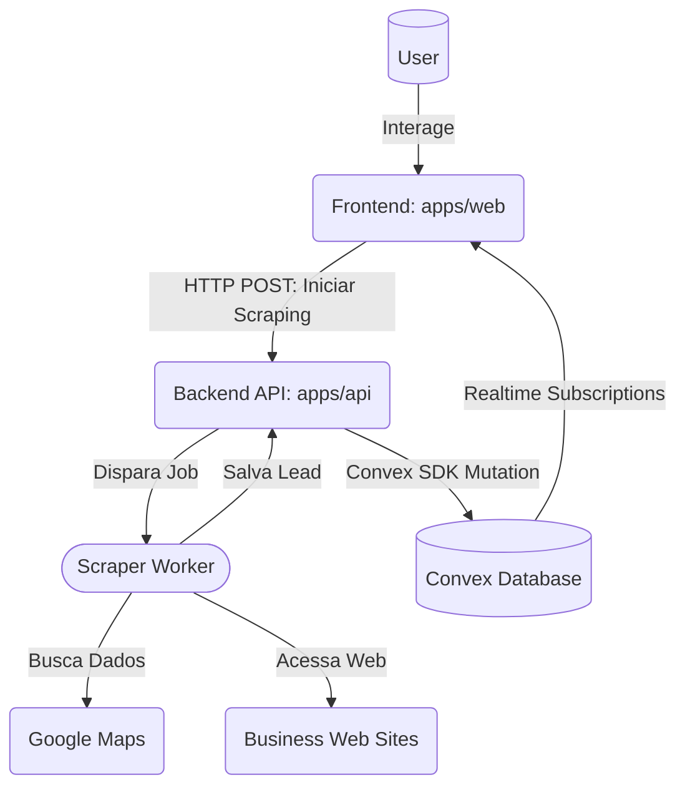

# Architecture: Maps Business Scraper

## 1. Executive Summary
O Maps Business Scraper é uma aplicação monorepo composta por uma interface React focada na experiência do usuário para buscar contatos comerciais e uma API Node.js robusta que orquestra automação de navegador (Playwright/Crawlee) para extração de dados públicos (nome, website, nicho, telefones e redes sociais). A aplicação utiliza o servidor Convex para armazenamento de dados centralizado e atualizações em tempo real no frontend, criando uma ponte assíncrona eficaz entre os jobs de scraping longos e a interface responsiva.

## 2. Technology Choices
| Layer | Technology | Rationale |
|---|---|---|
| Gerenciador de Pacotes | `npm` (Workspaces) | Suporte nativo e robusto para monorepos, dispensando a complexidade extra do lerna ou pnpm para estruturas simples. |
| Linguagem Base | TypeScript | Tipagem estática reduzindo bugs na integração entre Frontend, API e Banco de Dados. |
| Frontend Web | React (Vite) + Tailwind CSS | Performance em tempo de build com Vite; padronização de interfaces ricas com Tailwind CSS. Google Maps API / Leaflet exibirão geolocalização. |
| Backend API | Node.js + Fastify | Fastify oferece processamento rápido e baixo overhead, essencial ao lidar com sub-processos ou requisições de raspagem. |
| Web Scraper | Playwright / Crawlee | Ferramenta moderna e antidetecção para automação de browsers chromium-based, fundamental para extrair páginas dinâmicas. |
| Database / Realtime | Convex | DB serverless com mutações e queries tipadas ponta-a-ponta e subscriptions reais nativas, excelente para notificar o React quando a API terminar uma raspagem. |

## 3. System Diagram

## 4. Folder Structure
- `apps/web/`: Frontend em React/Vite responsável por receber a "cidade" e "nicho", e listar leads salvos.
- `apps/api/`: Backend em Node.js/Fastify, recebe solicitações para iniciar a esteira do web scraper.
  - `apps/api/src/routes/`: Endpoints HTTP RESTful.
  - `apps/api/src/scraper/`: Orquestradores do Playwright (Crawler de mapas, crawler de contatos web).
  - `apps/api/src/db/`: Interação backend -> Convex (gravar e registrar erros do scraper).
- `packages/config/`: Configurações compartilhadas JSON/JS do monorepo (ESLint, Prettier, Typescript Base).
- `convex/`: Esquemas de tabelas, actions e queries do backend Serverless hospedado pelo Convex.
- `ARCHITECTURE.md`: Este documento.
- `GEMINI.md`: Regras globais pros Agentes.

## 5. Data Flow
1. **Request:** O Usuário digita "São Paulo" e "Restaurantes" no React UI (`apps/web`) e clica em Buscar.
2. **Trigger:** O React UI faz uma chamada HTTP POST para a API (`apps/api/src/routes`) enviando os filtros. (Alternativamente, a API pode fornecer uma Mutation via custom webhook do Convex, mas para processamento local intenso do Playwright, o Node gerencia o processo).
3. **Execution:** O `apps/api` recebe o web request, responde de imediato `202 Accepted` com um "JobID" ou "SessionID", e começa o Crawlee no fundo (`apps/api/src/scraper`).
4. **Scraping:** O navegador oculto navega pelo Maps, pega o CNPJ parcial/Nome/Website. Para cada website achado, navega pra ele para achar os "hrefs" do IG/Fb/LinkedIn.
5. **Storage:** Conforme um Lead é completado, o Worker do Node.js usa o `convex` (SDK oficial Node.js) chamando uma Mutation para inserir a `BusinessEntity` na tabela do Convex.
6. **Realtime Update:** O `apps/web`, que possui um `useQuery(api.business.bySearchSession...)`, recebe a notificação em stream-real e desenha a Lead/Pino do Mapa instantaneamente na tela do usuário.

## 6. Key Design Decisions & Trade-offs
1. **Separação API e Convex Backend:** Embora o Convex *possa* executar funções JS (via `v8 actions`), raspagem de dados via Playwright necessita de renderização headless ou bibliotecas nativas de SO (Chromium) que o ambiente sandbox do Convex não suporta. Logo, o Node.js atua como "Trabalhador pesado local", enquanto o Convex atua como "Database + Real-time broker".
2. **Monorepo com npm workspaces:** Mantém a consistência de pacotes (ex: Playwright/React partilhando TS), mas com pastas independentes, de forma que a inicialização do Playwright não infle o client side bundle.

## 7. Environment & Configuration
| Envar | Type | Example | Description |
|---|---|---|---|
| `CONVEX_DEPLOYMENT` | string | `dev:calm-alpaca-123` | ID do deployment Convex. |
| `VITE_CONVEX_URL` | string | `https://calm-alpaca-123.convex.cloud` | URL do servidor Convex acessada pelo frontend React. |
| `API_PORT` | number | `3001` | Porta do servidor local do backend Node.js (`apps/api`). |

## 8. Development Setup
1. Clonar/Abrir a pasta raiz `maps-business-scraper`.
2. Rodar `npx convex dev` na raiz para instanciar as credenciais e schema do Convex local/dev (isto salvará os env vars do Convex automaticamente).
3. Rodar `npm install` na raiz do monorepo para popular todos os pacotes das workspaces.
4. Ter um tab rodando `npm run dev --workspace=apps/api` (Backend Fastify no porto 3001).
5. Ter um tab rodando `npm run dev --workspace=apps/web` (Frontend React no porto 5173).

## 9. Roadmap / Next Steps
1. Setup Inicial do Monorepo: `package.json` raiz + definições de Workspaces.
2. Setup do Apps/Web: Inicializar o React Vite com Tailwind.
3. Setup do Apps/API: Instalar Fastify, TypeScript, Playwright e Crawlee.
4. Setup do Convex: Inicialização do projeto, esquema de tabelas (`BusinessLeads`).
5. Implementar Mutações e Queries Básicas no Convex.
6. Construir Formulários de Busca e Tabela em Tempo Real no `apps/web`.
7. Programar a Rota HTTP no Fastify (`apps/api`) recebendo as configs de busca.
8. Escrever os scripts do Crawlee de busca do Google Maps e subsequente crawl do Website para captura de social links.
